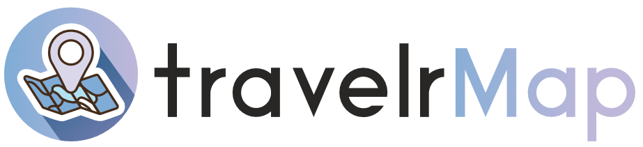
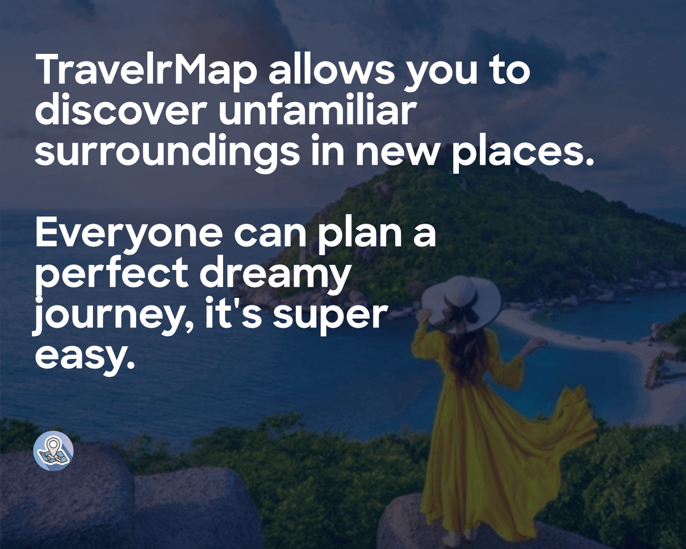
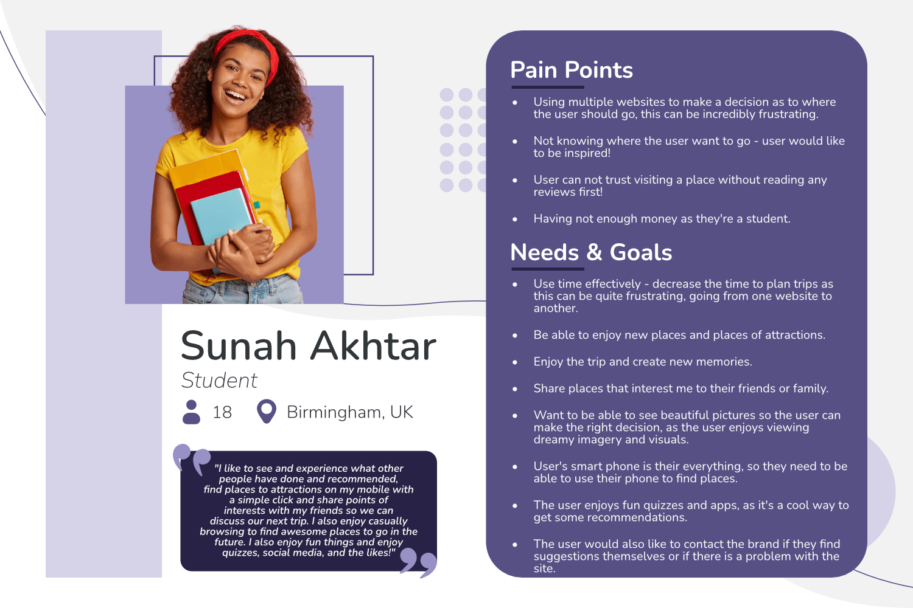

# TravelrMap

### _Your ultimate travel companion. Discover unfamiliar surrondings in new places._
[Back To Top](#travelrmap)

# Table of Contents
- [UX](#ux)
  * [Goals](#goals)
    * [External User Goal:](#external-user-goal)
    * [Product Owner Goal:](#product-owner-goal)
  * [Purpose](#purpose)
    * [Why](#why)
  * [Buyer Personas](#buyer-personas)
    * [User Interview 1](#user-interview-1)
    * [User Interview 2](#user-interview-2)
    * [User Interview 3](#user-interview-3)

# UX
## Goals
A travel web application for travellers to create a lifetime experience for themselves and others with less hassle. The website allows users to find their site of attraction conveniently and efficiently, by providing useful information and/or suggestions on places to visit based on the user's interests. Perfect for those who are looking to visit an unfamiliar city and enable them to _learn, discover, find new adventures and explore new cultures._

### External User Goal:
- Find the most suitable holiday destination to fulfil their needs.

### Product Owner Goal:
- Allow users to find places of attractions from TravelrMap so the website becomes a popular site in exploring new destinations. 

## Purpose
The project's purpose is to help increase the love of travelling by **removing the hassle of using multiple sources** to plan a trip and increase positive user experience, **by aiding their travel search with providing the right information at the right time**. 

Users should find the website application eliciting a positive emotional response, as it is intuitive, simple and most importantly fun to use!

_TravelrMap is an online application that allows users to easily find interesting places. This enables users to help plan their next trip by finding all of their information on one site._

### Why?

**TravelrMap will help change the way people think about travelling**

Why not inspire yourself with sites of attractions listed from the most exclusive locations, and help plan your trip! 

[Back To UX](#ux)

[Back To Top](#travelrmap)

## Buyer Personas

Before jumping to developing my wireframes and begin coding, I decided to do a bit of user research to help feed my user stories. I interviewed a couple of friends and family to identify their goals and expectations when they travel.

### User Interview 1: 

[Back To Buyer Personas](#buyer-personas)

[Back To UX](#ux)

[Back To Top](#travelrmap)