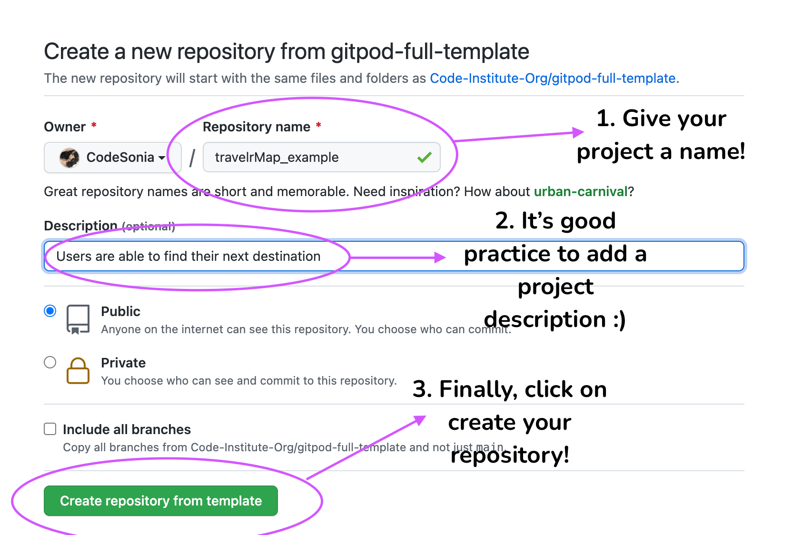

# TravelrMap

### _Your ultimate travel companion. Discover unfamiliar surrondings in new places._

Visit the live website here: [TravelrMap](https://codesonia.github.io/travelrMap/)
[Back To Top](#travelrmap)

# Table of Contents
- [UX](#ux)
- [Strategy](#strategy)
  * [Goals](#goals)
    * [External User Goal:](#external-user-goal)
    * [Product Owner Goal:](#product-owner-goal)
  * [Purpose](#purpose)
    * [Why](#why)
  * [Buyer Personas](#buyer-personas)
    * [User Interview 1](#user-interview-1)
    * [User Interview 2](#user-interview-2)
    * [User Interview 3](#user-interview-3)
  * [User Pain Points](#user-pain-points)
    * [Disintegrated planning and booking](#disintegrated-planning-and-booking)
    * [Mobile Booking](#mobile-booking)
    * [Not having the right information](#not-having-the-right-information)
  * [User Expectations](#user-expectations)
  * [Business Solution](#business-solution)
  * [Values](#values)
    * [Value for the User](#value-for-the-user)
    * [Value for TravelrMap](#value-for-travelrmap)
  * [User Stories](#user-stories)
  * [Strategy Table](#strategy-table)
- [Scope](#scope)
  * [Functional Specifications](#functional-specifications)
  * [Content Requirements](#content-requirements)
  * [Release 1: (Informative Stage)](#release-1-informative-stage)
  * [Release 2: (Extra Functionality)](#release-2-extra-functionality)
  * [Release 3: (End Product)](#release-3-end-product)
- [Structure](#structure)
  * [Consistency](#consistency)
  * [Visible](#visible)
  * [Learnable](#learnable)
  * [Feedback](#feedback)
  * [Information Architecture](#information-architecture)
- [Skeleton](#skeleton)
- [Surface](#surface)
  * [Research](#research)
  * [Logo](#logo)
- [Features](#features)
  * [Existing Features](#existing-features)
  * [Features Left to Implement](#features-left-to-implement)
- [Technologies Used](#technologies-used)
- [Testing](#testing)
  * [Automated Testing](#automated-testing)
  * [Manual Testing](#manual-testing)
- [Deployment](#deployment)
- [Credits](#credits)
- [Research Credits](#research-credits)

# UX

Before writing any code, I conducted user research and used Jesse James Garrett's User-Centred Design process to help ensure TravelrMap is useful, useable and provides value to both users and site owner.

[Back To Top](#travelrmap)
# Strategy

## Goals
A travel web application for travellers to create a lifetime experience for themselves and others with less hassle. The website allows users to find their site of attraction conveniently and efficiently, by providing useful information and/or suggestions on places to visit based on the user's interests. Perfect for those who are looking to visit an unfamiliar city and enable them to _learn, discover, find new adventures and explore new cultures._

### External User Goal:
- Find the most suitable holiday destination to fulfil their needs.

### Product Owner Goal:
- Allow users to find places of attractions from TravelrMap so the website becomes a popular site in exploring new destinations. 

## Purpose
The project's purpose is to help increase the love of travelling by **removing the hassle of using multiple sources** to plan a trip and increase positive user experience, **by aiding their travel search with providing the right information at the right time**. 

Users should find the website application eliciting a positive emotional response, as it is intuitive, simple and most importantly fun to use!

_TravelrMap is an online application that allows users to easily find interesting places. This enables users to help plan their next trip by finding all of their information on one site._

### Why?

**TravelrMap will help change the way people think about travelling**

Why not inspire yourself with sites of attractions listed from the most exclusive locations, and help plan your trip! 

[Back To Strategy](#strategy)

[Back To Top](#travelrmap)

## Buyer Personas

Before jumping to developing my wireframes and begin coding, I decided to do a bit of user research to help feed my user stories. I interviewed a couple of friends and family to identify their goals and expectations when they travel.

### User Interview 1: 

### User Interview 2: 

### User Interview 3: 

To summarise:

## User Pain Points:

### Disintegrated planning and booking

 

The internet has vast amount of information in how people can easily plan and book their travel. However, as travel sites and information has increased, so has the complexity of planning and booking a trip.

- It takes too much time and hassle to find points of interests when planning trips. As a user they'll have to visit various websites or applications to find their required details to make an informed choice.
- Feeling overwhelmed from having to navigate multiple pages and having to keep many tabs open, adding complexity to make a decision. This creates a negative experience for a user, as travel _should_ be a fun thing to do!
  - Nielson [1] research has found that:
    >Travelers spent an average of 53 days visiting 28 different websites over a period of 76 online sessions. 

That is a lot of time and effort for the average person to find their right travel plans. This can be further negative/painful for someone who is trying to plan an itinerary alongside a full-time career and family commitments. 

#### Mobile Booking

70% of millennials book travel activities on mobile sevices. Research from Google Consumer Insights find that more than half of South Korean and Japanese smartphone users research, book and plan their trips on their mobile devices! [2]

- If applications and websites do not operate on mobile, then user experience will thus decrease. Therefore, it is imperative to ensure TravelrMap is fulfilling this need.

### Not having the right information

As users can become quite overwhelmed, as pointed earlier, not having the right information at once can impair user experience when travelling - organisation of travelling should be fun, not hard work. 

Users like to ensure that they're accumulating the right information, i.e. weather, location, travel and, other's experiences and so on. 

It also means, that users would like to know someone else had an enjoyable experience, before making the choice. According to Tnooz [3], 95% of consumers read reviews before booking. This means if this information is not presented, value is not provided to the user.

[Back To Buyer Personas](#buyer-personas)

[Back To Strategy](#strategy)

[Back To Top](#travelrmap)

## User Expectations:

- Mobile-friendly
- Display points of interests in a visual manner
- Easy navigation so the user are aware where they are on the website and purpose of each page.
- Minimal content and beautiful imagery
- Catchy and compelling headlines
- Design is unique and stands out
- Dark mode
- Minimal amount of steps when making a purchase or booking
- Emotional triggers - feeling that the application gives the consumer sense of belonging (branding)
- Various types of content: video tutorials/white papers/blogs/testimonials/FAQ's/webinars
- 404 error to inform users that a page does not exist
- User feedback when user makes an error

[Back To Strategy](#strategy)

[Back To Top](#travelrmap)

## Business Solution:

- Build an informative website application which provides useful information for the users when planning to travel or wanting to feel inspired for their next trip.
- Allow users to share their points of interests with their friends or families.
- Instant adventure - modern travellers look for more flexibility when they're quite spontaneous while travelling, meaning being influences by weather or mood. TravelrMap will allow users to find points of attractions while on their trip to aid this. 

[Back To Strategy](#strategy)

[Back To Top](#travelrmap)

## Values:

### Value for the User:
- Maximum time saved on finding and discovering places to go with reduced amount of hassle.
- Able to easily navigate pre-travel and during travel plans.
- Creating a sense of community of those who love travelling and who are planning a trip together. 

### Value for TravelrMap: 
- Increased brand awareness as a one-stop shop.
- Lead nurtuting.
- Be able to include a features booking whereby users are able to directly purchase when searching.
- Able to build strategic partnerships with booking.com, AirBnB, SkySkanner, hotel.com and so on.
- With increased traffic, can look to commercialise the website by selling advertising space. Also, devise partnership schems with attractions/hotels/restaurants to illustrate accurate information such as prices, promotional offers and booking availability.

_Please note, some of these values are more aligned for long-term goals for TravelrMap, as it will not be feasible to develop all of this at once. Please see below Strategy Table and Scope for more context._

[Back To Strategy](#strategy)

[Back To Top](#travelrmap)

## User Stories

As a Product Owner...

- I want to be able to use the website myself, if I was looking or discovering a new place for a new adventure.
- I want to be able to be contactable, so I can listen to user feedback or help my users.
- I want to be able to provide user feedback, so that my users are able to rectify their mistake by TravelrMap being helpful in identifying user error.

As a User...

- I want to be able to easily navigate the webiste so that I can find the content I am looking for. 
- I want to be able to find destinations, so that I can see a variety of choices before making a decision.
- I want to be able to contact TravlerMap regarding any query.
- I want to be able to access social media accounts, so I can be part of TravelrMap's community.
- I want to be able to switch to a dark mode version of the website, so that when I am browsing in the night or evening, it will help reduce eye strain.

[Back To Strategy](#strategy)

[Back To Top](#travelrmap)

## Strategy Table

Opportunity/Problem/Feature | Importance | Viability
--------------------------- | ---------- | ---------
Navbar -  Referring to interaction design, allowing the user to clearly identify where they are on a website | 5 | 5
Plan an itinerary/trip - select destinations and start scheduling details and points of interests | 4 | 1
About/How to Use | 5 | 5
Share & Connect using social media and connect with travel lovers around the world | 5 | 5
Quiz - "What do you love most about travelling" to make travelling fun and exciting and get recommendations | 5 | 4
Micro interaction using animation - AOM scroll/animate.js/hamburger icon/landing page animation | 4 | 2
TravelrMap | 5 | 4
Search & Filter - users should be able to search for tips according to preferences. It helps the user find their next trip adventure and include suggestions to remind, guide and stimulate users to perform a certain action. When a user is searching, it should also prompt the user what they could search for | 5| 3
Enable location services - ask the user if we can use their location details | 5 | 3
Favourite a place of interest | 4 | 2
Recommendations for you | 5 | 3
Places of interest's details - shows a picture of place, information, temperature, map picker, reviews, nearby attractions. | 5 | 3
404 Error | 5 | 3
Gamification | 3 | 1
Contact Form | 5 | 5
Newsletter Sign-up | 5 | 3
Dark Mode | 4 | 2
Mobile Friendly | 5 | 4
Social media links | 5 | 5
AI to help users make decisions | 3 | 1
Total | 92 | 64

[Back To Strategy](#strategy)

[Back To Top](#travelrmap)

# Scope 
As identified from the strategy table, it is not feasible to create every feature during the first development. As a result, I have listed 3 phases and identified what the minimum viable product is. This means, Phase 1 should be enough to satisfy TravelrMap's users and will have the opportunity to gather user feedback. 

This will also allow TravlerMap to excite users when new features are developed - it is an on-going process! Especially with AI and automation being at the forefront of technology it would be cool to develop the project further one day using AI and algorithms to help users make effective decisions when organising travel and exploring what destination should be next.

### Functional Specifications:
- TravelrMap (map feature)
- Contact Form
- Trip Details

### Content Requirements: 
This is important since "__Content is King!"__ which implies that the reasoning as to why people revisit your website again, if it is useful, relevant, accessible and digestible. 

- Mixed content such as imagery and text
- Minimal content 
- Large imagery/beautiful visuals
- Eye-catching slogans and tag-lines
- Creative design - illustration and animation the landing page will captivate users.

## Release 1: (Informative Stage)
- Navbar
- About
- Micro Animation 
- TravelrMap (map feature)
- Contact Form
- Mobile Friendly 
- Social media links 
- Enable Location Services
- 404 Error Page

## Release 2: (Extra Functionality)
- Filter 
- Favourite 
- Dark Mode
- Where To Go? (quiz)
- Locations

## Release 3: (End Product)
- Create an itinerary and finding an itinerary 
- Share & Connect 
- Registration/Dashboard
- Gamification
- Bookings 

The great thing about having a MVP and planned releases enables me to create a "WOW" effect. Therefore, as I unfold new features, new user experiences are created for the future. Thus, surprising users with incremental changes that have meaningful values.

[Back To Scope](#scope)

[Back To Top](#travelrmap)

## Structure 
To leverage user's prior behaviour and experience, I incorporated interaction design. This means that I took advantage of design patterns and sequences that provide options to the user i.e. navigation or order of menu items.

I also incorporated information architecture, which meant that the organisation, arrangement and priority of content were considered. For example, when users read a navbar they tend to read from the left to right, thus, the top priority of information were displayed on the left with diminishing priority.

### Consistency 

- Navbar Elements
  - Users expect the logo identifying the site to be on the top-left corner and the primary navigation to be across the top or down the left-side.
- Follow conventions - elements are located and behave the way users expect. Using Jakob's Law, users prefer a website application to work the same way as all the other sites they already know. Therefore, when considering structure, and to make my site easy to use, I followed the following standardised design patterns:
  - Visual Hierarchy
  - Pages are broken up into clearly defined areas
  - A link is obvious that it is clickable
  - Eliminating distractions
  - Format content to support scanning i.e. golden ratio or z-rule
- Elements and interactive features are consistent, both in coding and theme.
- Leveraging upon user's prior experience.
- Labels/buttons/terms are consistent throughout the design.
- Content and imagery have a stable and consistent style
  - Incorporating both visual imagery and illustrations

### Visible

 

- All elements are discoverable and easy to find & use.
- Incorporate content hinting, where partial elements are revealed
  - i.e. partially reveal the next section of the page, just above the fold so that users are encouraged to scroll. This helps with TravelrMap being intuitive.

### Learnable

- Provide a strong sense of place i.e. indication of which page a user is on or page title.
- Users expect that when hovering their mouse over a nav-link, they'll be revealed through sub-menus.

### Feedback 

- Clearly visit change in state i.e. color change
- Clear feedback if inputting a form incorrectly
- Instructional design providing user feedback in the case of user error i.e. broken link or 404 error.

### Information Architecture

- Create visual hierarchies
  - It influences the order in which our eye chooses to look at elements
  - Appearance of elements on the page (visual cues) accurately portray the relationship between the things on the page
    - which things are most important
    - which things are smaller
    - which things are part of other things
  - Typography Scale
    - Majority of the interface will be occupied by text.
      - The most important element is more prominent.
        - Larger, bolder and distinctive color or closer to the top of the page.
      - Things that are related logically are related visually 
      - Nesting 
  

[Back To Structure](#structure)

[Back To Top](#travelrmap)

## Skeleton
I wanted to ensure the flow and functionality is seamless for the users before development stage. As I have features releasing in phase 2 and 3, I intend the website to evolve as a platform where users are able to book their destination. 

In addition, it'll also encompass different continents and regions such as Europe, Middle Eastern, Africa and so on. 

Please click on the following to view wireframes:

[WIREFRAMES.md](WIREFRAMES.md)

[Back To Skeleton](#skeleton)

[Back To Top](#travelrmap)

# Surface

## Research
I spent some time on researching other travel sites and applications to get a feel of what is currently out there, design patterns and inspiration. I created a moodboard of certain features I'd like to adopt into my project.

## Logo

For TravelrMap, I designed my own logo. The logo consists of a map and location marker. This is to help reinforce the site's purpose and branding. 

# Features

## Existing Features

- Navbar
  - Easily able to navigate around the website as it has clear links and implies the order of priority of information. It is also fixed to the top, which helps guide users around the application. The navbar also collapses into an interactive hamburger icon when viewed on smaller devices. It also has further interactivity, as it closes when a user clicks on an item. This helps with the user experience.

- About 
  - The about section includes an engaging image, implying that a user can almost reflect and connect with the image as they could possibly picture themselves searching on the net for next travel destinations.
  - It also has engaging text to help create excitement for the user.

- Micro Animation
  - The application incorporates micro animation i.e. hamburger icon as explained in the above.
  - When a user scrolls, sections appear from the side or from the bottom. This helps add a touch of modernism to TravelrMap as sites incorporate smooth animation.

- Contact Form
  - I have incorporated a simple contact form with html validation. I have also connected the contact form using EmailJS. This allows users to send enquries to the site owner.
  - When a user inputs their contact details, an outline appears. This is done so users are aware of which input section they're completing.
  - Submit/Modal - once a user is able to click submit, a modal opens up, thanking the user for their enquiry. It also states that users should expect an email response within 24 hours. This helps set user expectations.

- Map 
  - I've used Google Maps and Places API to help create a map feature. The feature allows users to identify places of interests in corresponding countries and cities.
  - Accordion dropdown menu - this allows users to easily select a Country and then the respective City.
  - Upon selecting a Country and City, it allows users to filter out their options to Restaurants, Cafe, Hotel etc. I also incorporated a jQuery tooltip to allows users to understand what the icon is. I did include easily identifiable icons, but just to reinforce the title of the icons, a tooltip helps with this.
  - Users are also able to search for a place. If a user searches with an empty space, user feedback is given and an alert is thus shown to prompt the user they need to type something to obtain results.
  - A results sidebar appears and dynamically changes accordingly (on search query, filter, City and Country).

- Get Location button 
  - I've incorpoated a fun, get location button that allows users to identify their current location. This is of course, dependant on privacy and informs users accordingly if they're successful or not. 

- Dark Mode
  - I've also incorporated a dark mode feature, however, not all styling has been completed. This is due to short project time, and I wanted to show the assessors that I am able to create a script that enables users to toggle from day to night.

- Landing Page Animation
  - I wanted to create a "wow" impression, so I created a walking cycle using After Effects. I then exported this into a JSON format and uploaded to Lottie Files. I wrote a script that enables this to appear on medium sized devices onwards. 
  - The purpose of this is to show that interactvity such as animation, can be used.

- 404 Error Page
  - Created a simple 404 error page to inform users of any broken links. It is also good practice to help direct users back to the home page.

  _The above will be illustrated on user testing_

[Back to Features](#features)

[Back to Top](#travelrmap)

## Features Left To Implement

- Locations
  - I would like to build my locations page which will show users curated spots and places of interests in selected countries.
  - This will also include a map and cluster markers of places of interests where users can dynamically filter out options.
  - They would also be inspired as they'll be shown pictures and video content to help inform their decisions.

- Reviews
  - I would like to incorporate reviews under sections, where users can view Google Reviews. This would be a great feature to help reaffirm user's decisions and/or help with decision-making.

- Dark Mode
  - I would like to complete the styling of the dark mode.

- Quiz 
  - This would be a nice, fun feature where users can select their preferences and get recommendations as to which destination they should visit. 

[Back to Features](#features)

[Back to Top](#travelrmap)

# Technologies Used
- [HTML](https://developer.mozilla.org/en-US/docs/Web/HTML)
  - used to structure the website and create the essential elements of my site. 
- [CSS](https://www.w3.org/Style/CSS/Overview.en.html) 
  - used to style the markup and create custom styling. 
- [JavaScript](https://www.javascript.com/) 
  - used to manipulate the Document Object Model (DOM) elements while adding interactivity via functions, event listeners and so on.
- [JQuery](https://jquery.com)
    - used jQuery library to extend JavaScript functionality and help speed up the process.
- [Bootstrap](https://getbootstrap.com/)
  - used as the core structure of the website and make my site responsive. It also includes pre-built plugins such as jQuery. 
- [Google Developer tools](https://developers.google.com/web/tools/chrome-devtools/) 
  - to help solve a bug and help style my elements before writing code. 
- [Google Maps API](https://developers.google.com/maps)
  - used to enable maps
- [Google Places API](https://developers.google.com/maps/documentation/places/web-service/overview)
  - used to enable filter options and allow users to identify places of interest
- [EmailJS](https://www.emailjs.com/)
  - API used to enable users to send an email to site owner
- [Google Fonts](https://fonts.google.com/) 
  - used to import the font style and help create a unique brand. 
- [GitPod](https://www.gitpod.io/) 
  - used as the development environment to help write my code. 
- [Git](https://git-scm.com/) 
  - to enable version control and help commit changes to my site. 
- [GitHub](https://github.com/) 
  - used to store the source code and repository. 
- [GitHub Pages](https://pages.github.com/) 
  - used to deploy my website.
- [AutoPrefixer](https://autoprefixer.github.io/)
  - used to help parses your CSS and adds vendor prefixes
- [Balsamiq](https://balsamiq.com/) 
  - used to help create my wireframes. 
- [TinyPanda](https://tinypng.com/)
  - used to help compress the sizes of the images. 
- [Affinity Photo](https://affinity.serif.com/en-gb/photo/) 
  - used to help edit my photos and create my graphics. 
- [Affinity Designer](https://affinity.serif.com/en-gb/designer/) 
  - used to to help edit and create my graphics. 
- [Grammarly](https://app.grammarly.com/)
    - used to rectify any grammar errors. 
- [Hover.css](https://ianlunn.github.io/Hover/)
    - used to add hover effects onto elements
- [Adobe Illustrator](https://www.adobe.com/uk/products/illustrator.html)
    - used to convert illustration layers to the top in order for me to create movements onto after effects
- [After Effects](https://www.adobe.com/uk/products/aftereffects.html)
  - used to create animation effects to add interactivity
- [Lottie Files](https://lottiefiles.com/)
    - used to upload my After Effects animation into a json format
- [AOM](https://github.com/michalsnik/aos#animations)
  - used to add fade effects when scrolling 
- [Jon Suh's Animated Hamburgers](https://jonsuh.com/hamburgers/)
  - used to create an animated handburger and used jQuery to toggle
- [Favicon Generator](https://realfavicongenerator.net/)
  - used to create favicons
  
# Testing

Please view [TESTING.md](TESTING.md)

# Deployment

TravelrMap project was deployed using GitHub Pages. Please follow the following steps when deploying a project on GitHub:

1. Log onto GitHub account or create an account if you do not have one! 

2. For this project, I used a template generated by [Code Institute](https://github.com/Code-Institute-Org/gitpod-full-template).

Click on `Use this template`.

3. Give your project a title and a description. You can then click on `Create repository from template`

4. You can now open your workspace (P.S. I use GitPod for this)

5. You now need to initialise your repository. Type in the following command on the terminal `git init`

  - Create your boilerplate and files, including assets
  - Write a concise commit message `git commit -m "git init"`

6. You can deploy your project, whenver you are ready. (It is best practice to deploy early to avoid any discrepencies!)

7. Go to your project repository, and click on settings.

8. On the left-hand side, click on "Pages"

9. Now, you need to select "Master Branch" under the Source heading:

10. The page will now automatically refresh, with a deployment link! If it does not refresh, give it at least 5 minutes and refresh the page.

11. And you are done! Your project has now been deployed using GitHub Pages:

## Running Code Locally 

You can also run my project locally, by clicking on the repository, click `clone or download` and `download zip`. Alternatively, you could paste `git clone git@github.com:CodeSonia/travelrMap.git` into the terminal and type `git remote rm` original to remove itself from the repository.

## Forking a GitHub Repository

You are able to "fork" a project. This enables you to generate a copy of the repository and allows you to freely experiment without affecting the original repository.

You can easily fork a project by clicking on `fork`:

[Back to Deployment](#deployment)

[Back to Top](#travelrmap)

# Credits

- [Geo Location](https://stackoverflow.com/questions/6797569/get-city-name-using-geolocation) 
  - able to create a function enabling geo location
- [Google Places API](https://developers.google.com/maps/documentation/places/web-service/overview)
  - for providing foundation on incorporating API into application
- Partner 
  - For maintaining positivity and providing support during my application
- Fatima at Code Institute
  - Tutor support and guidance, especially when emailJS was not working. Fatima provided documentation and support and resulted me in fixing my issue (Thank you! :))
- Maksim 
  - For supporting me while creating the animation and providing guidance on how to create a walking cycle
- Marcel (mentor)
  - For providing constructive criticism and support for application
# Research Credits:
1. https://www.mdgadvertising.com/marketing-insights/7-travel-marketing-trends-worth-exploring-in-2017/
2. https://www.thinkwithgoogle.com/consumer-insights/consumer-journey/consumer-travel-smartphone-usage/
3. https://www.rezdy.com/resource/travel-statistics-for-tour-operators/ 

