# Testing

## Testing Tools

### Google Developer Tools
Throughout development, I used Google Developer Tools to help identify any errors that I faced. For example, the developer tools alerted me that my variables in my JavaScript files were not defined, ths helped rectify tedious issues. It also helped be debug and test functions and the logic.

In conjunction, the developer tools has a responsive feature. This was a handy tool during development, as it showed me how TravelrMap looked across several devices. This was insightful, as it alerted me of issues like overlapping elements which can impact user experience.

[Back to Testing Tools](#testing-tools)

[Back to Top](#testing)

### HTML Validator
To help validate my HTML, I used W3C validator tool to ensure my HTML was clean. I regularly checked during development each section, ensuring my code was free from error.

A couple of errors highlighted and rectified:

- ` Warning: The type attribute is unnecessary for JavaScript resources.` 

  __Solution__
  - I rectified this by removing the `type="text/javascript"`. After removing this, I checked if the contact form was still working and operated to which it did.

- `: An img element must have an alt attribute, except under certain conditions.` 

  __Solution__
    - I rectified this by providing the alt tag. Whenever I declare an img element, I have been adding the alt tag, however, I need to harness this further and ensure I am not missing this out. I understand how the `alt tag` is incredibly important for assessibility.

- ` Element legend not allowed as child of element div in this context`. 

  __Solution__
  
  - I rectified this by moving the legend tag and directly under fieldset element.` I used these semantic elements to help users identify the form and input elements.

The below shows that there are currently no errors to be found in index.html.

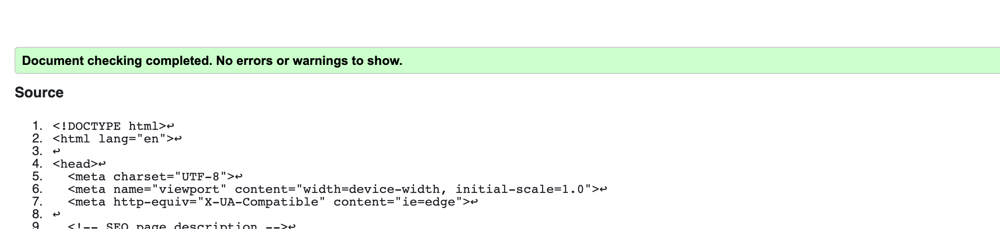

I also checked the 404.html page, and there are also no errors:

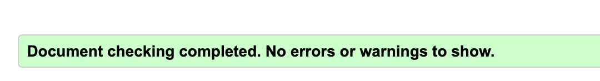

[Back to Testing Tools](#testing-tools)

[Back to Top](#testing)

### CSS Validator 
In order to ensure my CSS was free from errors, I used W3C validator. All CSS files were free from any error:

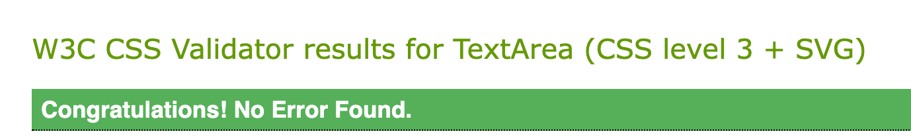

[Back to Testing Tools](#testing-tools)

[Back to Top](#testing)

### Responsive Tools
Although, Google Developer Tools on the inspect feature, you can view your site on different devices, I further wanted to ensure my site is mobile-friendly and responsive. Also, as I do not have extensive devices, this was imperative to ensure my site is responsive. 

I used [Am I Responsive](http://ami.responsivedesign.is/) and [Responsinator](https://www.responsinator.com/) to ascertain if my site is responsive or not. I used this in conjunction with Google Developer Tools during development and added media queries to ensure my site behaved as expected. This was great as it helped rectify any alignment issues.

[Back to Testing Tools](#testing-tools)

[Back to Top](#testing)

### Wave Report/ Accessibility Testing

As accessibility grows importance, I tested my site using the WAVE report. Please see the following errors/bugs I faced which are now resolved:

1. Broken Link

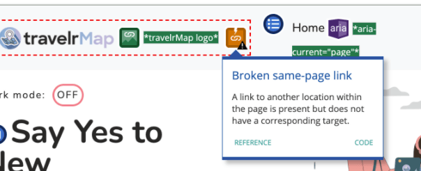

  __Solution__
  - Corrected link to homepage

2. Empty Links
On the footer section, under social media icons, I did not include any links to the respective social media websites. 

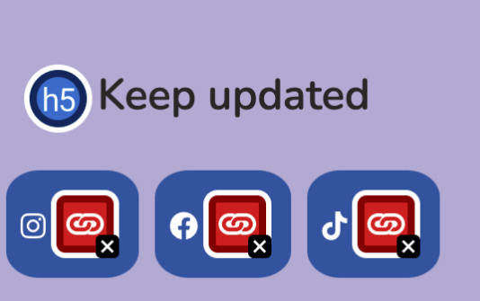

__Solution__
- Updated each social media icon to it's respective social media website page. I also added `target="_blank"` attribute so the site opens on another tab.
- I also updated this further, by adding a `sr-only` attribute to the respective span elements, so screen readers are aware of what the icon link means.

[Back to Testing Tools](#testing-tools)

[Back to Top](#testing)

### JSHint
In order to validate my JavaScript code, I used [JSHint](https://jshint.com/) and configured the settings so it enabled jQuery code and new JavaScript features.

Please see the following reports:

#### aos.js
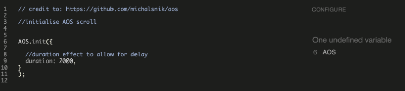

__Solution__
  - Stored AOS into a variable:
    - `let AOS;`

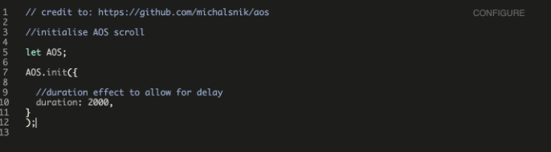

#### Countries JS file

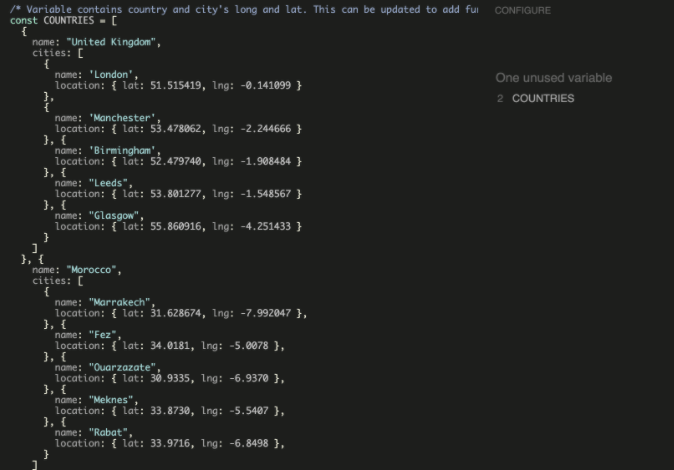

__Solution__
  - I ignored the unused variable error, due to the `const COUNTRIES` variable being used in other files. The separate file sheet was created for countries, to allow for other countries to be added without faffing about. It also separates the sheet and keeps the files organised, as well as being accessed via namespace.

#### Dark Mode JS file

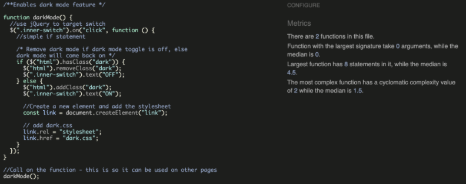

No errors identified!

#### Email JS file

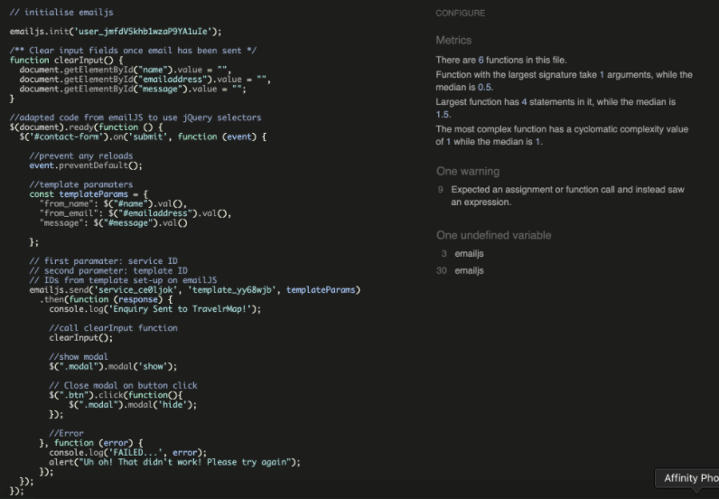

__Attempted__
- I did attempt to rectify the warning and undefined variable. However, the emailJS did not work, so I have chosen to ignore this now.

- The `clearInput()` function is being called in the emailJS.send and attempted to add a stronger comparion `===` however, that did not work. I have therefore, put this error aside. I will attempt to rectify this error in the future.

#### Geo Location JS file

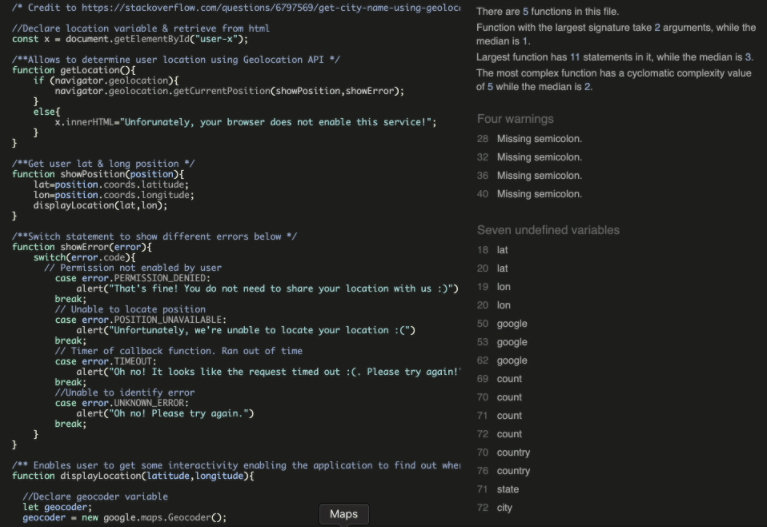

__Solution__
  - I added the missing `;`
  - I also stored the undefined variables
  - However, it says that google and getLocation are unsused variable.

#### Hamburger JS file

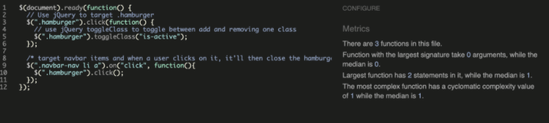

No errors!

#### Landing Page Animation JS file

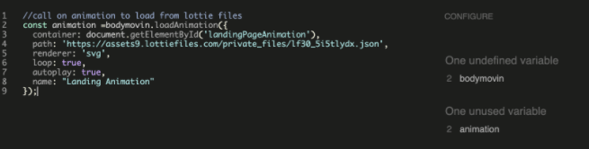

__Solution__
  - `bodymovin` variable is accessed via the Lottie Files CDN to enable the animation to load, so I ignored the error here.

#### Map Filter JS File

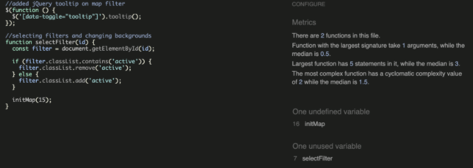

  - I ignored the errors here, due to `initMap` defined by Google Maps API. 
  - The `selectFilter()` is being used in a separate JS file.

#### Map JS file

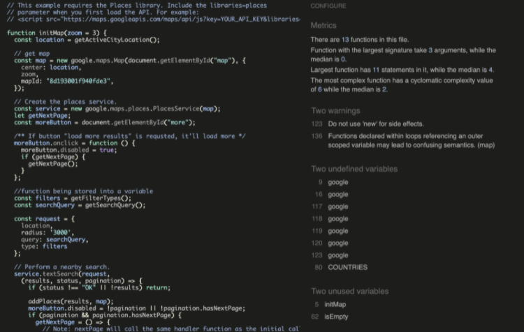
  - `google` and `COUNTRIES` variables have been defined in separate files. Therefore, this was ignored. 

#### Menu JS file

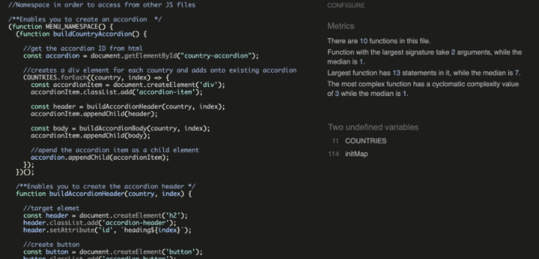

 - The same as above. 

[Back to Testing Tools](#testing-tools)

[Back to Top](#testing)

## Manual Testing

### Functionality

#### Links and Buttons
Component | Function | Work as Intended? | Fix
--------- | --------- | ----------------- | ------|
TravelrMap Logo | Takes the user back to homepage | Yes | N/A
Navbar: Home | Takes the user to the homepage | Yes | N/A
Navbar: About | Takes the user to the about section | Yes | N/A
Navbar: Map | Takes the user to the map section | Yes | N/A
Navbar: Contact | Takes the user to the contact section | Yes | N/A
Home: Dark Mode Button | Enables users to toggle between light and dark theme | Yes | N/A
Home: Social Media Links - Instagram | Allows the user to view TravelrMap's account on a new tab | Yes | N/A
Home: Social Media Links - Facebook | Allows the user to view TravelrMap's Facebook account on a new tab | Yes | N/A
Home: Social Media Links - TikTok | Allows the user to view TravelrMap's TikTok account on a new tab | Yes | N/A
Home: Get Location! button | Alerts the user where their location is (if location is enabled) | Yes | N/A
Home: Get Location! button | Location not enabled: throws an error | Yes | N/A
Home: Get Location! button | Clicking on it too many times, results into error alert | Yes | N/A
Home: Map button | Takes the user to the map section | Yes | N/A
Map: Accordion | Drop-down menu allowing you to select Country and City | Yes | N/A
Map: Accordion Filter | Allows you to select a filter and produce results | Yes | N/A
Map: Search button | Does not allow a user to input nothing and throws an error | Yes | N/A
Map: Search input | Enables user to search for location | Yes | N/A
Map: Sidebar | Allows users to select on results and shows the icon on maps | Yes | N/A
Map Sidebar load more results button | Enables users to produce further results | Yes | N/A
Contact Us: email link| Enabling the user to use a clickable link to send an email as an alternative to filling out a form | Yes | N/A
Contact Us: Send message button | Does not allow a user to input null / 0 input and prompts user to input correct fields | Yes | N/A
Footer: Social Media Links | Social media links link to an external tab and correct links | Yes | N/A

#### Hover Underline
Component | Function | Work as Intended? | Fix
--------- | --------- | ----------------- | ------|
Navbar: Home | When a user hovers on Home on navbar, an underline appears | Yes | N/A
Navbar: About | When a user hovers on About on navbar, an underline appears | Yes | N/A
Navbar: Map | When a user hovers on Map on navbar, an underline appears | Yes | N/A
Navbar: Contact | When a user hovers on Contact on navbar, an underline appears | Yes | N/A

#### Micro Animation
Component | Function | Work as Intended? | Fix
--------- | --------- | ----------------- | ------|
Navbar: Home | On Mobile hamburger icon toggles open and closes | Yes | N/A
Section: AOS scroll effect | Scroll animation works | Yes | N/A

[Back to Manual Testing](#manual-testing)

[Back to Top](#testing)

## Testing User Stories

_Please note, some of the user stories overlap_

1. As a user, I want to be able to easily navigate the webiste so that I can find the content I am looking for. 

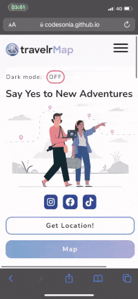

2. As a user, I want to be able to find destinations, so that I can see a variety of choices before making a decision.
 
 - Click on the Map secton on navbar
  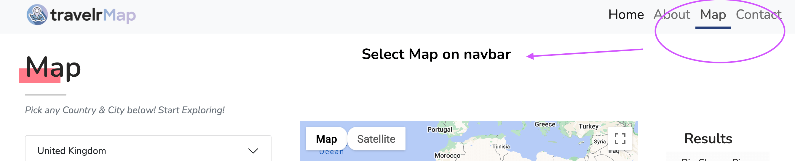

  - Alternatively, a user is able to click on the Map button on the landing page, which will also directly lead the user to the Map Feature:

  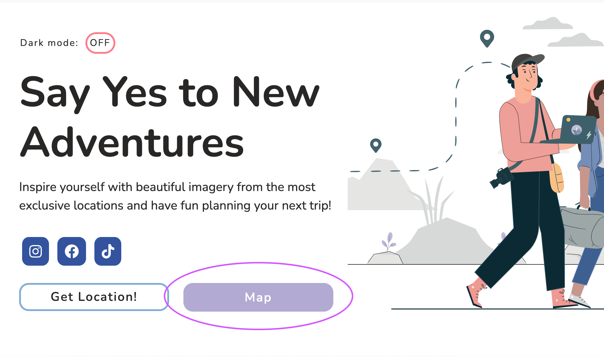

  As you can see, the map button changed it's color state to indicate when a button has been hovered or not. 

- Select a Country and then a City from the accordion feature

  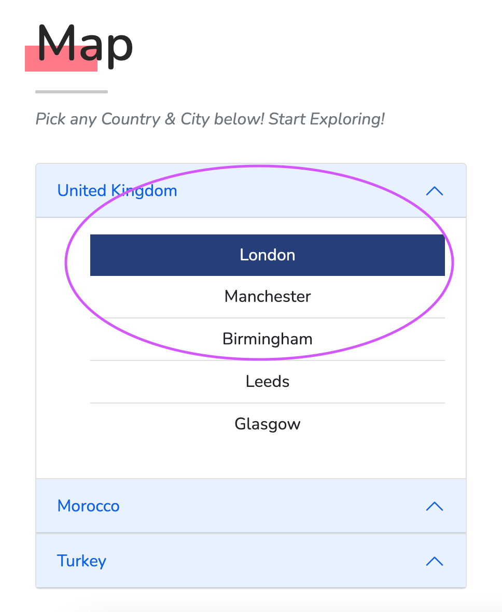

- A user is then presented with filters and can select one a filter like so, which generates results. This allows users to be particular when searching and, is then able to see a variety of choices:

  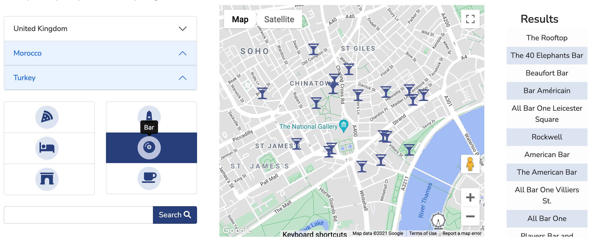

  - The user is also able to hover over the filter icons where they'd be shown what the filter is (if they're unsure)

- A user is also able to search a query. If the user does not input anything, it displays an alert accordingly, prompting the user:

  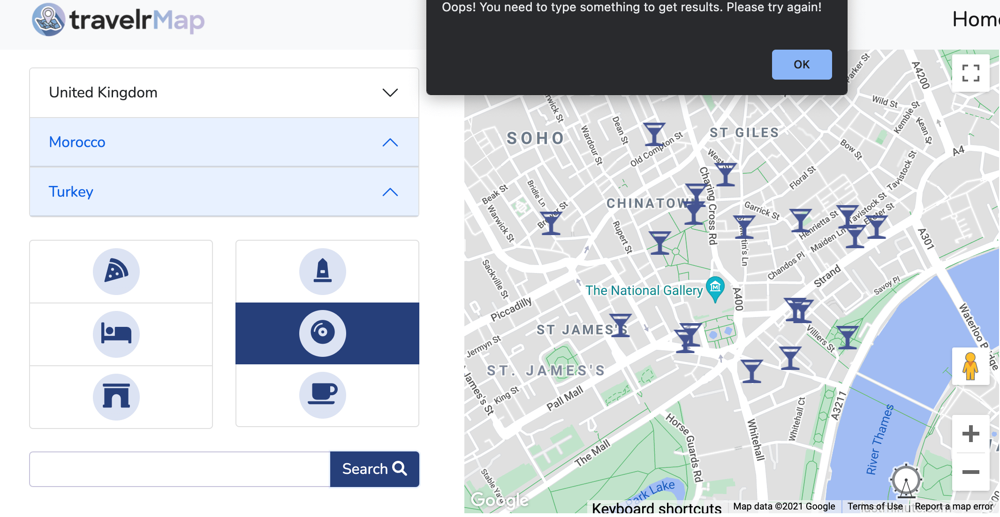

- As a user input's their query, results are dynamically shown. This allows the user see where the place of interest is and the location name

  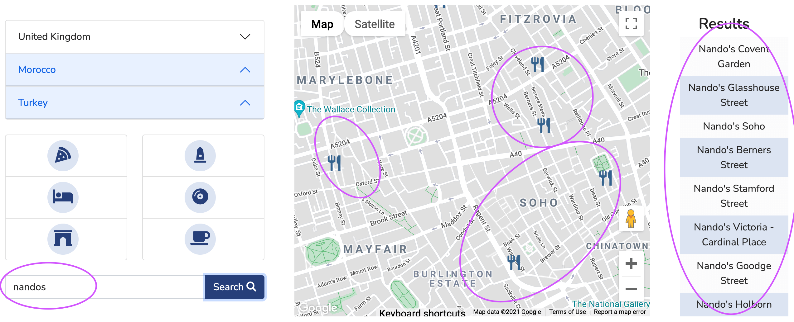

3. As a user, I want to be able to contact TravlerMap regarding any query.

  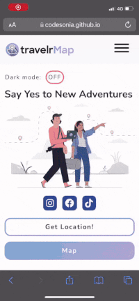

  A user is able to click on Contact on navbar, where they are taken to the contact section. A user is then prompted to enter valid inputs into the input fields. 

  As soon as the enquiry is sent, the user is informed with a modal. 

  The input fields are cleared too! 

  Confirmation that the email is working and has been sent to site owner:

  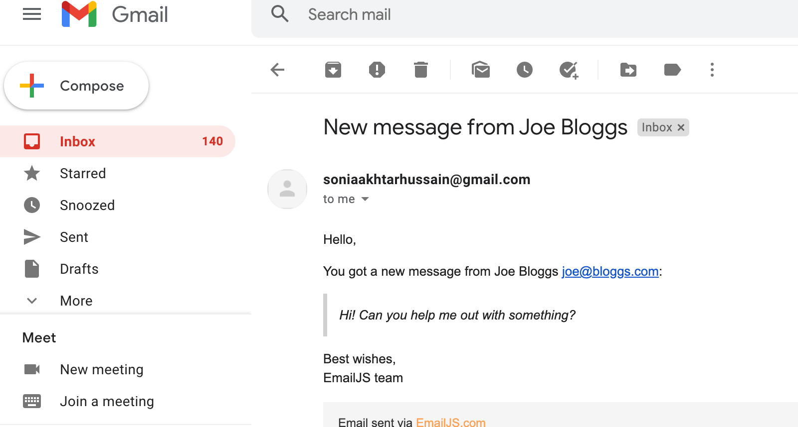

4. As a user, I want to be able to access social media accounts, so I can be part of TravelrMap's community.

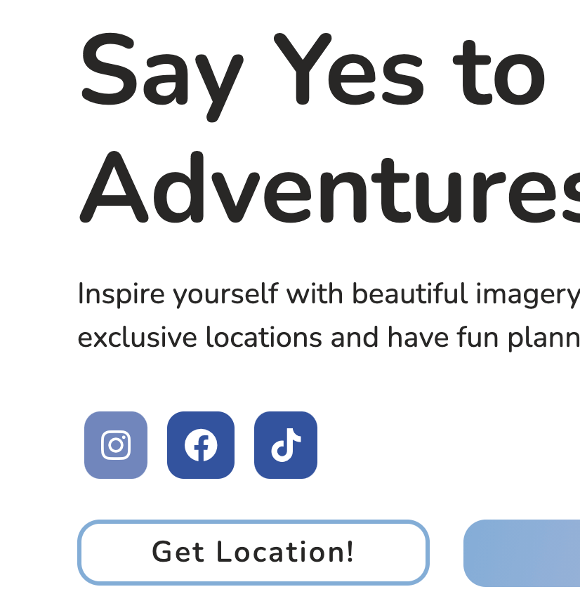

Users are able to click on the social media links and be directed to social media accounts accordingly. Unfortunatley, TravelrMap does not have a any social media accounts as it is fictional, but this is to show good practice (opens in new tab, and color state changes when clicked).

5. As a user, I want to be able to switch to a dark mode version of the website, so that when I am browsing in the night or evening, it will help reduce eye strain.

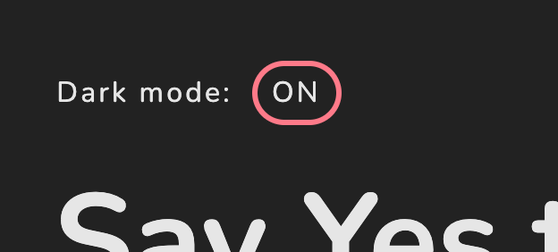

A user is able to toggle the button off and on.

6. As a user, I want to be able to return back to the site home page if I accidently arrive at a non-existent page

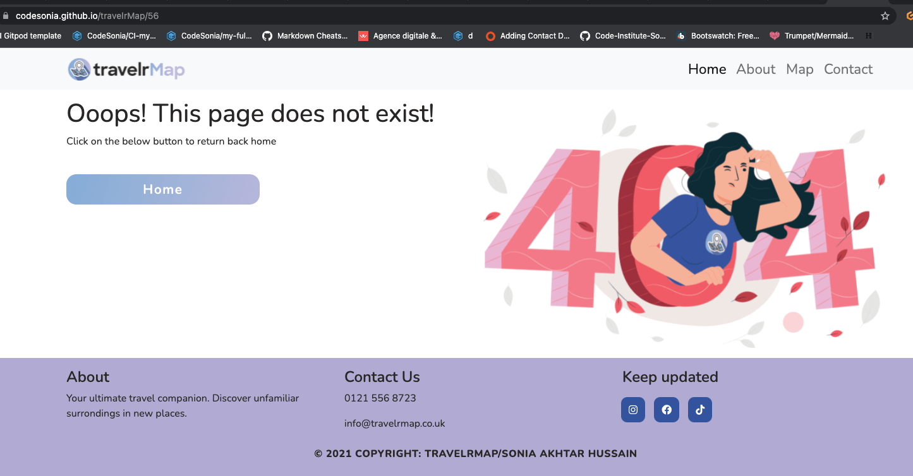

[Back to Manual Testing](#manual-testing)

[Back to Top](#testing)

## Responsiveness

Component | Function | Work as Intended? | Fix
--------- | --------- | ----------------- | ------|
**Text**| Should be clear, concise and visible on mobile, tablet and desktop devices| Yes | N/A
**Layout**| Layout should be easily organised with logical hierarchy and elements are not overcrowded| Yes | N/A
**Images**| Images should not appear distorted or pixelated and maintain it's aspect ratio | Yes | N/A
**Functionality**| Functionality should be maintained on all screen sizes| Yes | N/A

[Back to Top](#testing)

[Back to README.md file](README.md)

